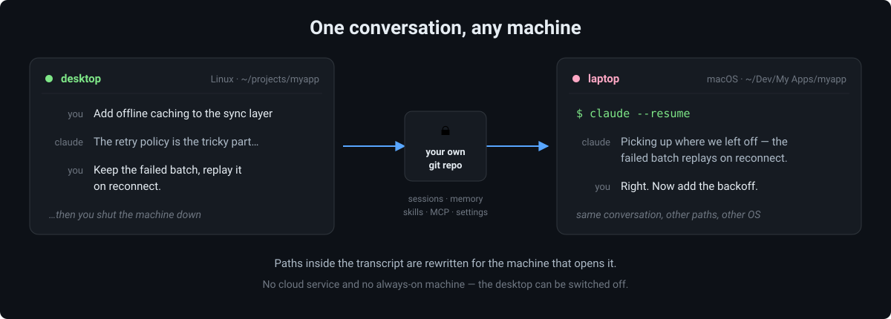

# claude-code-sync

Your Claude Code state — sessions, memory, skills, commands, hooks, MCP servers,
plugins and settings — kept in sync across every machine you work on, through a
private git repository of your own.

Work on your desktop, close the session, open the same session on your laptop and
carry on from the same place. Install an MCP server or a skill here, and it shows
up everywhere. Different operating systems, unrelated paths, no always-on machine
required.

*[Русская версия](README.ru.md) · [Adding another machine](BOOTSTRAP.md)*



---

> ### ⚠️ Do not use this repository directly
>
> This repository is a **starting point**, not a service. If several people
> pushed into it, their sessions and memory would end up mixed together in one
> place — and public.
>
> Press **“Use this template” → set visibility to Private**, and work with the
> repository you get. It starts with a clean history and belongs only to you.
>
> **Do not fork it either.** A fork of a public repository on GitHub is always
> public, and cannot be made private — your transcripts, memory and settings
> would be readable by anyone. “Use this template” is the button that gives you
> a private copy.
>
> Pull requests to this repository are not accepted; see
> [CONTRIBUTING.md](CONTRIBUTING.md). Bug reports and questions are welcome in
> Issues.

---

## What gets synced

| | |
|---|---|
| **Sessions** | Transcripts, so `/resume` on another machine continues the same conversation |
| **Memory** | Fact files, each scoped to one machine, one OS, or all of them |
| **Tools** | `skills/`, `commands/`, `hooks/`, `plans/` — symlinked into the vault |
| **MCP servers** | Rendered from a template, with per-machine scopes and secrets stripped |
| **Plugins** | The list, so a new machine tells you what to install |
| **Settings** | `settings.json`, merged rather than overwritten |

Never synced, deliberately: `.credentials.json` (OAuth tokens — on macOS they
live in Keychain anyway), the machine passport, your secrets file, plugin caches,
shell snapshots and other machine-local state.

## How it works

**Paths are tokenized.** The same project sits at unrelated paths on different
machines, and one cannot be computed from another:

```
linux-desktop   /home/alex/projects/MyApp
mac-laptop      /Users/alex/My Projects/Android/Compose/MyApp
win11-pc        D:\Projects\Android\MyApp
```

So on the way out paths collapse into `{{P:myapp}}/app/build.gradle` and
`{{HOME}}/.claude/…`, and on the way in they expand for the current machine —
right separators, right drive letter. The mapping “project key → path on each
machine” lives in `project-map/`, one file per machine.

**Registries are sharded per machine.** `machines/<machine>.json` and
`project-map/<machine>.json` are each owned by exactly one machine. That is what
keeps two machines that worked offline from meeting in a merge conflict.

**Memory has scopes.** A fact about your job is true everywhere; a fact about the
graphics driver on one laptop is not. Each fact carries `scope` in its
frontmatter (`global`, a machine id, `os:linux`, a list, or `!machine` for
“everywhere except”), and every machine gets a `MEMORY.md` rendered for itself:
what applies here, and — listed separately, not to be applied — what belongs to
the others. MCP servers use the same scoping.

**Two different mechanisms, on purpose.** Skills, commands, hooks, plans and
memory files are things you edit, so they become symlinks into the vault: an edit
is already in git. `settings.json`, MCP servers and the plugin list are rewritten
by Claude Code itself at runtime, so a symlink there is dangerous — they are
rendered from templates on every `pull`, and `settings.json` is merged three-way
with your local file winning any conflict. Your model, theme and plugins survive.

**Secrets never enter the repository.** A value under a key that looks like a
token becomes `{{ENV:NAME}}` in the template, and is filled back in from
`~/.claude/ccsync-secrets.env`, which is local and git-ignored. If a secret is
missing on a machine, the server is installed without it and you are told which
variables to add.

**A project that is not bound here still works.** Its sessions are laid out under
`~/claude-sessions/<key>` — they open and read fine, there are simply no project
files next to them. Bind the project later with `/sync-bind` and the old layout
is cleaned up on the next pull, but only once nothing is left in it that the new
copy does not already have.

## Why not just a synced folder

**Dropbox, iCloud, a synced folder.** Claude Code writes to the transcript after
every reply, so two machines produce a steady stream of conflicts — and such
folders resolve them by last-writer-wins, which quietly loses turns. That is the
smaller problem. The bigger one is that a transcript is full of absolute paths
from the machine that wrote it; copying the bytes does not make them valid
anywhere else.

**rsync or scp by hand.** Same path problem, plus you have to remember what to
copy and when, in both directions, with no history and nothing to roll back to.

**A dotfiles repository.** Solves settings and skills, and stops there: no
sessions, no path rewriting, and no way to say “this fact is about the laptop
only” — machine-specific notes spread to every machine and mislead the agent.

**Remote control into the other machine.** Requires that machine to be running
and reachable. This is the opposite trade: everything is asynchronous, and the
machine you left can be shut down, reinstalled, or on a plane.

**Just git over `~/.claude`.** It is hundreds of megabytes of live state —
plugin caches, shell snapshots, credentials — rewritten while you work, with
absolute paths baked into `settings.json` and the MCP config. That repository
conflicts on every pull and leaks secrets on the first push.

## What leaves your machine, and what never does

Everything lives in **your own private repository**; nothing is sent anywhere
else, and the engine talks to no service but your git remote.

| Synced | Never synced |
|---|---|
| Session transcripts, with paths tokenized | `.credentials.json` and OAuth tokens (on macOS they are in Keychain anyway) |
| Memory facts, each scoped | `ccsync-machine.json` — this machine's identity |
| Skills, commands, hooks, plans | `ccsync-secrets.env` — your tokens, git-ignored |
| MCP definitions, secrets replaced by `{{ENV:NAME}}` | Plugin caches, shell snapshots, `history.jsonl` |
| The plugin list and merged `settings.json` | Anything you mark with `/sync-ignore` |

Two things worth knowing before you trust it with real work. A transcript that
has already been pushed is removed by `/sync-forget`, but that is an ordinary
commit — **git history is not rewritten**, so clones made earlier still hold the
old commits. And the `Stop` hook pushes every few minutes, so `/sync-ignore` has
to be set early to be of any use.

## Requirements

- Claude Code, on close versions across your machines — the transcript format
  changes between releases
- git and Python 3 (3.9+); no third-party packages, the engine is stdlib only
- a **private** git repository of your own (GitHub, GitLab, your own server)

## Getting started (first machine)

1. **Use this template → Private.** Do not skip the private part.
2. Clone it, and clone it to this exact path — the slash commands reference it:

   ```bash
   git clone <your repository url> ~/claude-code-sync
   ```

3. Create this machine's passport. It suggests an id; pick something you will
   recognise later, such as `linux-desktop` or `win11-laptop`:

   ```bash
   python3 ~/claude-code-sync/bin/ccsync.py init
   ```

4. **Adopt what you already have.** This moves your existing `skills/`,
   `commands/`, `hooks/` and `plans/` into the vault (with a backup in
   `~/.claude/backups/`) and replaces them with symlinks, and copies your memory
   files into `memory/facts/`:

   ```bash
   python3 ~/claude-code-sync/bin/ccsync.py adopt
   ```

   Do not skip this step on your first machine. Memory is pushed *from* the
   vault, and the symlink that puts it there is only created once `memory/facts`
   is non-empty — `adopt` is what closes that circle.

5. Send it all up:

   ```bash
   python3 ~/claude-code-sync/bin/ccsync.py push all
   ```

6. Install the hooks, then push them too. The installer only adds hook entries to
   your `settings.json` and leaves everything else alone; `push` then folds the
   machine-specific paths into `{{PYTHON}}` and `{{VAULT}}`, so the other
   machines get them expanded for themselves:

   ```bash
   python3 ~/claude-code-sync/setup-hooks.py
   python3 ~/claude-code-sync/bin/ccsync.py push tools
   ```

7. Paste the block from [docs/claude-md-block.md](docs/claude-md-block.md) into
   your `~/.claude/CLAUDE.md`, and ask Claude to give the adopted facts their
   `scope`, `index_title` and `index_hook` fields.

8. Restart Claude Code and check that a session starts with a `[ccsync] Machine: …`
   line.

**Adding your second and further machines:** [BOOTSTRAP.md](BOOTSTRAP.md) — it is
a prompt you paste into Claude Code on the new machine. That is what it looks
like there: one command, and the machine has your skills, your memory and
yesterday's session.


<sub>Recorded on one host with two isolated `$HOME`s — the scenario lives in
`demo/` and every line in the frame is real engine output.</sub>

## Day to day

Hooks do the work: `SessionStart` pulls and tells Claude which machine it is on,
`Stop` pushes the transcript in the background (debounced, every five minutes),
`SessionEnd` pushes everything. The commands are there for when you want control:

| Command | |
|---|---|
| `/sync-push [all\|session\|tools\|memory]` | send this machine's state |
| `/sync-pull [all\|session\|tools\|memory]` | receive and lay it out here |
| `/sync-status` | what differs, without changing anything |
| `/sync-bind <key> [path]` | bind a project to its path here |
| `/sync-mcp [name] [--here\|--not-here\|--global]` | MCP servers and their scopes |
| `/sync-ignore [reason]` | keep this session out of the vault |
| `/sync-forget [id]` | forget a session everywhere (irreversible) |

## Privacy

Your vault is private, but two things are worth knowing.

**A session you never want to leave the machine** is `/sync-ignore`, and the mark
has to go on *early*: the background hook sends the transcript every few minutes,
so anything said before the mark is already in the vault.

**Something that already left** is `/sync-forget`. It deletes the copy in the
vault, leaves a tombstone so the other machines drop theirs on the next pull, and
removes the local transcript. It does this with an ordinary commit — git history
is not rewritten, so clones made earlier still hold the old commits.

## Extras

`extras/statusline.py` is an optional status line: model, effort level, 5-hour
and weekly limit usage with reset times, context fill, session cost. Nothing
installs it automatically — copy it to `~/.claude/statusline.py` and add to your
`settings.json`:

```json
"statusLine": { "type": "command", "command": "python3 ~/.claude/statusline.py", "padding": 0 }
```

## Branches

Unreachable branches on their own mean nothing: a long session usually has dozens
of them — abandoned continuations you walked away from yourself. So the engine
does not scan files for branch points. It compares the file before and after a
merge and speaks up only when something that *was* readable stopped being
readable — and only from six records up, because a single rewritten turn and
somebody else's branch are structurally identical, and only scale tells them apart.

When it does speak up:

```bash
python3 ~/claude-code-sync/bin/ccsync.py branches --session <id>   # what the branches are
python3 ~/claude-code-sync/bin/ccsync.py split <id>                # give each its own session
```

`branches` lists every branch with its size, the time of its last record and the
opening words, so you can recognise the one you want. `split` moves each branch
into a session of its own — after that every one of them opens whole and as
itself. The original file is kept in `~/.claude/backups/`.

## Language

The engine picks its language from `CCSYNC_LANG`, falling back to your locale
(`LC_ALL` / `LC_MESSAGES` / `LANG`) and then to English. English and Russian ship
with it:

```bash
CCSYNC_LANG=en python3 ~/claude-code-sync/bin/ccsync.py status
```

Adding your own is a JSON file and nothing else — copy
`bin/ccsync_lib/locales/en.json` to `<your-language>.json` and translate the
values; the keys are the original Russian strings the engine was written in. A
string with no translation falls back to that original rather than breaking, and
`tests/i18n-coverage.py` lists whatever is still missing.

Code comments stay in Russian: they are internal, and they do not stand between
you and the tool.

## Verifying

Three test rigs cover the engine — private sessions, registries diverging between
machines, and session keys. Each one builds its own `$HOME` and its own bare
repository, so they never touch your real setup:

```bash
tools/tests/run-all.sh
```

Worth running once on a new machine, to confirm the engine behaves there.

`tools/tests/resume-check.sh` is the one check that cannot be automated. It puts
a code word into a transcript and asks a live Claude Code for it after the
session is restored. Every other rig checks files — it arrived, it sits at the
right path, the records match — but none of them answers whether the model on the
other side actually sees the conversation, and you cannot tell by looking: with
an empty context Claude answers just as confidently. `--run` asks for you,
`--clean` cleans up.

`tests/run-all.sh` checks the template itself rather than the engine:
`fresh-start.sh` walks two throwaway machines through the whole first-machine
flow and back, asserting that nobody's `CLAUDE.md`, settings or skills got
overwritten on the way; `i18n-english.sh` runs every command with
`CCSYNC_LANG=en` and fails on any Cyrillic left in the output. Both clone the
**committed** state of this repository, so uncommitted edits are invisible to
them.

## Limitations, honestly

- **Keep Claude Code versions close** across machines: the transcript format
  changes between releases, and an older build may not read a newer session.
- **One session at a time.** Working in the same session on two machines
  simultaneously is not supported. `merge=union` keeps every record when two
  copies collide, but the file is whole only on the surface: Claude Code
  assembles the conversation by walking `parentUuid` backwards from the **last
  line of the file** — verified by running `claude --resume`, line order wins
  over timestamps — so one merged branch is read and the other stays in the file
  unreachable. See *Branches* below for what the engine does about it.
- **It is git, not realtime.** Expect a delay measured in minutes.
- **Transcripts over 50 MB are skipped** with a warning rather than silently —
  GitHub rejects files above 100 MB.
- **Native Windows is supported** (hooks call Python directly, JSON is assembled
  node by node, symlinks fall back to copies), but it has had less mileage than
  Linux and macOS.

## License

MIT — see [LICENSE](LICENSE).
