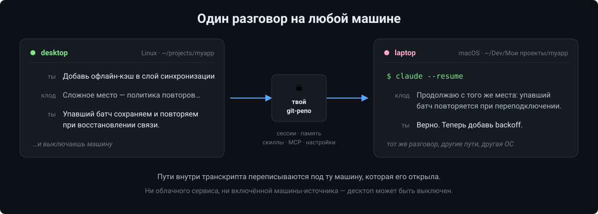
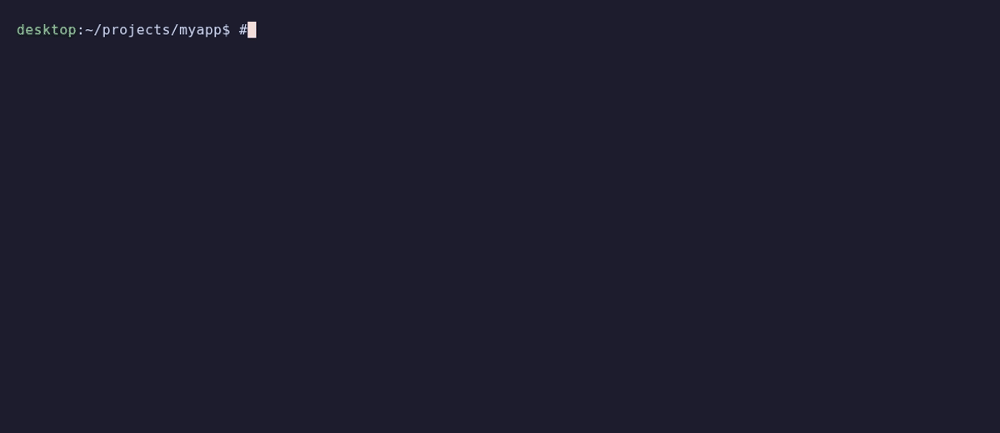

# claude-code-sync

Состояние Claude Code — сессии, память, скиллы, команды, хуки, MCP-серверы,
плагины и настройки — общее на всех ваших машинах, через ваш собственный
приватный git-репозиторий.

Поработали на десктопе, закрыли сессию, открыли её же на ноутбуке и продолжили с
того же места. Поставили MCP-сервер или скилл здесь — он появился везде. Разные
операционные системы, несвязанные пути, включённая машина-источник не нужна.

*[English version](README.md) · [Подключение новой машины](BOOTSTRAP.ru.md)*



---

> ### ⚠️ Не используйте этот репозиторий напрямую
>
> Это **заготовка**, а не сервис. Если в него начнут писать несколько человек,
> их сессии и память смешаются в одном месте — и станут публичными.
>
> Нажмите **«Use this template» и выберите Private**, дальше работайте со своим
> репозиторием. У него чистая история и он принадлежит только вам.
>
> **Форк тоже не подходит.** Форк публичного репозитория на GitHub всегда
> публичный, приватным его сделать нельзя — ваши транскрипты, память и настройки
> смог бы прочитать кто угодно. Приватную копию даёт именно «Use this template».
>
> Пул-реквесты сюда не принимаются, см. [CONTRIBUTING.md](CONTRIBUTING.md).
> Сообщения об ошибках и вопросы — пожалуйста, в Issues.

---

## Что синхронизируется

| | |
|---|---|
| **Сессии** | Транскрипты: `/resume` на другой машине продолжает тот же разговор |
| **Память** | Файлы фактов, у каждого свой scope — машина, ОС или «везде» |
| **Инструменты** | `skills/`, `commands/`, `hooks/`, `plans/` — симлинками в хранилище |
| **MCP-серверы** | Рендерятся из шаблона, со скоупами по машинам и без секретов |
| **Плагины** | Список: новая машина сама скажет, что доустановить |
| **Настройки** | `settings.json` — слиянием, а не перезаписью |

Сознательно не синхронизируется: `.credentials.json` (OAuth-токены, а на macOS
они вообще в Keychain), паспорт машины, файл секретов, кэши плагинов, снимки
шелла и прочее машинно-локальное состояние.

## Как это устроено

**Пути токенизируются.** Один и тот же проект лежит на разных машинах по
несвязанным путям, и вычислить одно из другого нельзя:

```
linux-desktop   /home/alex/projects/MyApp
mac-laptop      /Users/alex/My Projects/Android/Compose/MyApp
win11-pc        D:\Projects\Android\MyApp
```

Поэтому при выгрузке пути сворачиваются в `{{P:myapp}}/app/build.gradle` и
`{{HOME}}/.claude/…`, а при загрузке разворачиваются под текущую машину — с
нужными разделителями и буквой диска. Соответствие «ключ проекта → путь на
каждой машине» лежит в `project-map/`, по файлу на машину.

**Реестры разложены по машинам.** У `machines/<машина>.json` и
`project-map/<машина>.json` ровно один владелец. Именно это не даёт двум
машинам, поработавшим вне сети, встретиться в конфликте слияния.

**У памяти есть скоупы.** Факт о вашей работе верен везде, а факт о драйвере
видеокарты на одном ноутбуке — нет. У каждого факта во frontmatter стоит `scope`
(`global`, id машины, `os:linux`, список или `!машина` в значении «везде,
кроме»), и каждая машина получает свой `MEMORY.md`: что применимо здесь и —
отдельным разделом, применять не надо — что относится к остальным. У MCP-серверов
скоупы устроены так же.

**Два разных механизма, и это намеренно.** Скиллы, команды, хуки, планы и файлы
памяти правит человек, поэтому они становятся симлинками в хранилище: правка
сразу в git. А `settings.json`, MCP и список плагинов Claude Code переписывает
сам, на лету, — симлинк там опасен, поэтому они рендерятся из шаблонов при каждом
`pull`, причём `settings.json` сливается трёхсторонним merge, где при споре
побеждает ваше локальное значение. Модель, тема и плагины остаются вашими.

**Секреты в репозиторий не попадают.** Значение под ключом, похожим на токен,
превращается в шаблоне в `{{ENV:ИМЯ}}`, а подставляется из локального и
git-игнорируемого `~/.claude/ccsync-secrets.env`. Если секрета на машине нет,
сервер ставится без него, а вам называют недостающие переменные.

**Непривязанный проект работает всё равно.** Его сессии раскладываются в
`~/claude-sessions/<ключ>` — они открываются и читаются, просто рядом нет файлов
проекта. Привяжете проект позже через `/sync-bind` — прежняя раскладка уберётся
сама при следующем `pull`, но только когда в ней не осталось ничего, чего нет в
новой копии.

## Чем не подходит просто синхронизируемая папка

**Dropbox, iCloud, облачная папка.** Claude Code дописывает транскрипт после
каждого ответа, поэтому две машины дают непрерывный поток конфликтов — а такие
папки решают их по принципу «кто последний записал», молча теряя реплики. И это
меньшая беда. Большая в том, что транскрипт набит абсолютными путями машины,
которая его писала: скопировать байты не значит сделать их пригодными где-то ещё.

**rsync или scp руками.** Та же беда с путями, плюс надо помнить, что и когда
копировать, причём в обе стороны, без истории и без возможности откатиться.

**Репозиторий с dotfiles.** Решает настройки и скиллы — и на этом всё: ни
сессий, ни переписывания путей, ни возможности сказать «этот факт только про
ноутбук». Машинно-специфичные заметки расползаются по всем машинам и сбивают
агента с толку.

**Удалённый доступ к другой машине.** Требует, чтобы та машина была включена и
доступна. Здесь размен обратный: всё асинхронно, а машина, которую вы оставили,
может быть выключена, переустановлена или в самолёте.

**Просто git поверх `~/.claude`.** Это сотни мегабайт живого состояния — кэши
плагинов, снимки шелла, ключи доступа, — которое переписывается прямо во время
работы, с абсолютными путями внутри `settings.json` и конфига MCP. Такой
репозиторий конфликтует на каждом pull и утекает секретами на первом же push.

## Что уходит с машины, а что не уходит никогда

Всё живёт в **вашем собственном приватном репозитории**; никуда больше ничего не
отправляется, и движок не обращается ни к одному сервису, кроме вашего git.

| Синхронизируется | Не синхронизируется никогда |
|---|---|
| Транскрипты сессий, пути в них токенизированы | `.credentials.json` и OAuth-токены (на macOS они и так в Keychain) |
| Факты памяти, у каждого свой scope | `ccsync-machine.json` — идентичность этой машины |
| Скиллы, команды, хуки, планы | `ccsync-secrets.env` — ваши токены, в `.gitignore` |
| Описания MCP, секреты заменены на `{{ENV:ИМЯ}}` | Кэши плагинов, снимки шелла, `history.jsonl` |
| Список плагинов и слитый `settings.json` | Всё, что помечено через `/sync-ignore` |

Две вещи, которые стоит знать, прежде чем доверять этому рабочие разговоры.
Уехавший транскрипт убирает `/sync-forget`, но делает он это обычным коммитом —
**история git не переписывается**, поэтому в сделанных ранее клонах старые
коммиты остаются. И хук `Stop` отправляет данные каждые несколько минут, так что
`/sync-ignore` имеет смысл только поставленный заранее.

## Что нужно

- Claude Code близких версий на всех машинах — формат транскрипта меняется между
  релизами
- git и Python 3 (3.9+); сторонних пакетов нет, движок только на стандартной
  библиотеке
- ваш **приватный** git-репозиторий (GitHub, GitLab, свой сервер)

## Быстрый старт (первая машина)

1. **Use this template → Private.** Про Private не забудьте.
2. Склонируйте — именно по этому пути, на него ссылаются slash-команды:

   ```bash
   git clone <адрес вашего репозитория> ~/claude-code-sync
   ```

3. Заведите паспорт машины. Идентификатор предложит сам скрипт; выберите такой,
   по которому вы её узнаете, — `linux-desktop`, `win11-laptop`:

   ```bash
   python3 ~/claude-code-sync/bin/ccsync.py init
   ```

4. **Заберите то, что уже есть.** Команда перенесёт ваши `skills/`, `commands/`,
   `hooks/` и `plans/` в хранилище (с резервной копией в `~/.claude/backups/`) и
   заменит их симлинками, а файлы памяти скопирует в `memory/facts/`:

   ```bash
   python3 ~/claude-code-sync/bin/ccsync.py adopt
   ```

   На первой машине этот шаг пропускать нельзя. Память отдаётся *из* хранилища, а
   симлинк, который её туда кладёт, создаётся только когда `memory/facts` уже не
   пуст, — `adopt` и замыкает этот круг.

5. Отдайте всё:

   ```bash
   python3 ~/claude-code-sync/bin/ccsync.py push all
   ```

6. Пропишите хуки и отдайте их тоже. Установщик только дописывает хуки в ваш
   `settings.json`, ничего в нём больше не трогая, а `push` сворачивает пути
   машины в `{{PYTHON}}` и `{{VAULT}}` — на других машинах они развернутся уже
   под них:

   ```bash
   python3 ~/claude-code-sync/setup-hooks.py
   python3 ~/claude-code-sync/bin/ccsync.py push tools
   ```

7. Вставьте блок из [docs/claude-md-block.ru.md](docs/claude-md-block.ru.md) в
   свой `~/.claude/CLAUDE.md` и попросите Клода проставить перенесённым фактам
   поля `scope`, `index_title` и `index_hook`.

8. Перезапустите Claude Code и убедитесь, что сессия начинается со строки
   `[ccsync] Машина: …`.

**Вторая и последующие машины:** [BOOTSTRAP.ru.md](BOOTSTRAP.ru.md) — готовый
промт, который вставляется в Claude Code на новой машине. Вот как это выглядит
там: одна команда — и на машине уже ваши скиллы, ваша память и вчерашняя сессия.



<sub>Записано на одном хосте с двумя изолированными `$HOME`; сценарий лежит в
`demo/`, и каждая строка в кадре — настоящий вывод движка.</sub>

## Повседневность

Всё делают хуки: `SessionStart` тянет и сообщает Клоду, на какой он машине,
`Stop` отправляет транскрипт в фоне (с дебаунсом в пять минут), `SessionEnd`
отдаёт всё. Команды — на случай, когда хочется управлять руками:

| Команда | |
|---|---|
| `/sync-push [all\|session\|tools\|memory]` | отдать состояние этой машины |
| `/sync-pull [all\|session\|tools\|memory]` | принять и разложить здесь |
| `/sync-status` | что расходится, ничего не меняя |
| `/sync-bind <ключ> [путь]` | привязать проект к пути на этой машине |
| `/sync-mcp [имя] [--here\|--not-here\|--global]` | MCP-серверы и их скоупы |
| `/sync-ignore [причина]` | не отправлять эту сессию в хранилище |
| `/sync-forget [id]` | забыть сессию везде (необратимо) |

## Приватность

Хранилище приватное, но две вещи знать стоит.

**Сессия, которая не должна уехать вообще,** — это `/sync-ignore`, и пометку надо
ставить *рано*: фоновый хук отправляет транскрипт каждые несколько минут, поэтому
всё сказанное до пометки уже в хранилище.

**То, что уже уехало,** убирает `/sync-forget`. Он удаляет копию в хранилище,
оставляет отметку, по которой остальные машины снесут свои копии при ближайшем
`pull`, и удаляет локальный транскрипт. Делается это обычным коммитом — история
git не переписывается, поэтому в сделанных ранее клонах старые коммиты остаются.

## Дополнительно

`extras/statusline.py` — необязательная статус-строка: модель, уровень усилий,
расход 5-часового и недельного лимитов со временем сброса, заполненность
контекста, стоимость сессии. Автоматически она не ставится: скопируйте её в
`~/.claude/statusline.py` и добавьте в `settings.json`:

```json
"statusLine": { "type": "command", "command": "python3 ~/.claude/statusline.py", "padding": 0 }
```

## Ветки

Сами по себе недостижимые ветки ни о чём не говорят: в длинной сессии их обычно
десятки — это брошенные продолжения, к которым вы не вернулись. Поэтому движок не
ищет ветвления в файле. Он сравнивает версии до и после слияния и говорит только
тогда, когда читаемое перестало читаться, — и то начиная с шести записей: один
переписанный ход и чужая ветка структурно неотличимы, различает их лишь масштаб.

Когда он всё же сказал:

```bash
python3 ~/claude-code-sync/bin/ccsync.py branches --session <id>   # какие есть ветки
python3 ~/claude-code-sync/bin/ccsync.py split <id>                # дать каждой свою сессию
```

`branches` покажет каждую ветку: сколько записей, когда последняя и с чего
начинается — чтобы вы узнали нужную. `split` разнесёт ветки по отдельным
сессиям, и каждая после этого открывается целиком и своей. Исходный файл
останется в `~/.claude/backups/`.

## Язык

Язык вывода берётся из `CCSYNC_LANG`, иначе из локали (`LC_ALL` / `LC_MESSAGES` /
`LANG`), иначе английский. В комплекте английский и русский:

```bash
CCSYNC_LANG=en python3 ~/claude-code-sync/bin/ccsync.py status
```

Добавить свой язык — это один JSON-файл: скопируйте
`bin/ccsync_lib/locales/en.json` в `<язык>.json` и переведите значения; ключами
служат исходные русские строки, на которых движок написан. Строка без перевода
печатается в оригинале, а не ломает вывод, а `tests/i18n-coverage.py` покажет,
чего ещё не хватает.

Комментарии в коде остаются русскими: это внутренний текст, между вами и
инструментом он не стоит.

## Проверка

Движок закрыт тремя стендами — приватные сессии, расхождение реестров между
машинами и ключи сессий. Каждый поднимает собственный `$HOME` и собственный
bare-репозиторий, так что вашей настоящей машины они не касаются:

```bash
tools/tests/run-all.sh
```

На новой машине стоит прогнать один раз — убедиться, что движок здесь работает.

`tests/run-all.sh` проверяет уже саму заготовку, а не движок: `fresh-start.sh`
проводит две одноразовые машины по всему пути первой машины и обратно и
убеждается, что ничей `CLAUDE.md`, настройки и скиллы по дороге не затёрлись, а
`i18n-english.sh` гоняет все команды с `CCSYNC_LANG=en` и падает на любой
кириллице в выводе. Оба клонируют **закоммиченное** состояние репозитория —
незакоммиченных правок они не увидят.

## Ограничения, честно

- **Версии Claude Code должны быть близки.** Формат транскрипта меняется между
  релизами, и старая сборка может не прочитать сессию с более свежей.
- **Одна сессия за раз.** Работать в одной сессии одновременно на двух машинах
  нельзя. `merge=union` не даёт потерять записи при склейке двух копий, но целым
  файл остаётся только на вид: разговор Claude Code собирает обратным обходом
  `parentUuid` от **последней строки файла** — проверено запуском
  `claude --resume`, порядок строк перевешивает время записи, — поэтому из двух
  разошедшихся веток читается одна, а вторая остаётся недостижимой. Что с этим
  делает движок — в разделе «Ветки» ниже.
- **Это git, а не realtime.** Задержка измеряется минутами.
- **Транскрипты больше 50 МБ пропускаются** — с предупреждением, а не молча:
  GitHub не принимает файлы тяжелее 100 МБ.
- **Нативная Windows поддержана** (хуки зовут Python напрямую, JSON собирается по
  узлам, симлинки при недоступности заменяются копиями), но обкатана меньше, чем
  Linux и macOS.

## Лицензия

MIT — см. [LICENSE](LICENSE).
